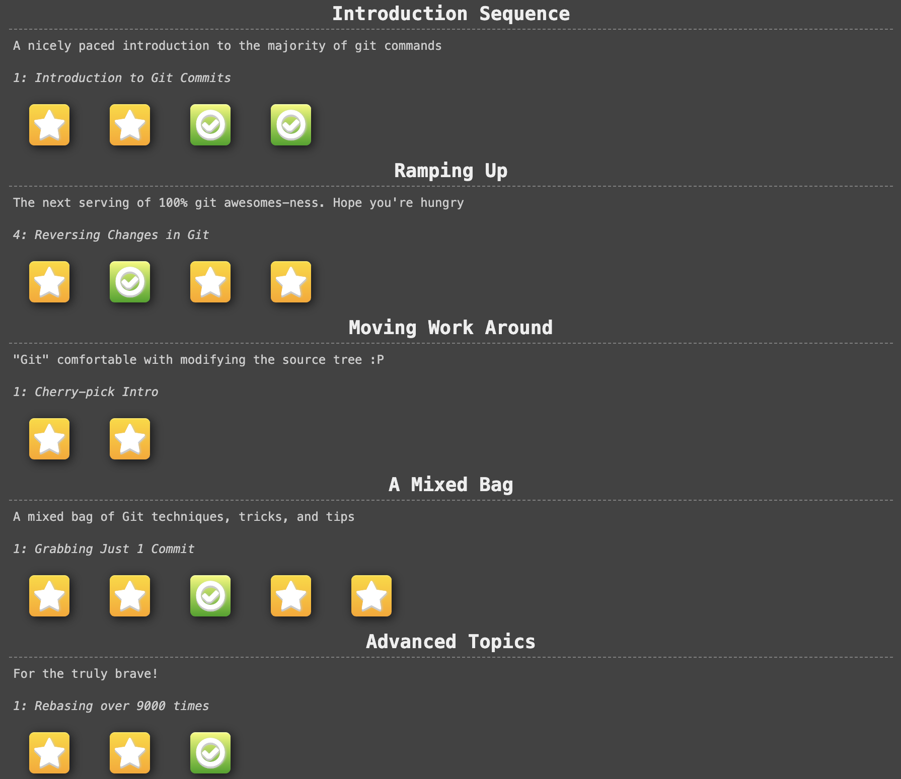

# 🌳 Git Mastering: From Zero to Rebase Ninja

Репозиторий содержит мои результаты прохождения интерактивного курса **Learning Git Branching** и конспекты по продвинутой работе с ветками. Это фундамент моей подготовки на пути к **AI Engineer**.

## 🚀 Что я освоил:
- **Базовая навигация:** работа с коммитами, ветками и слияниями (`merge`).
- **Продвинутая магия:** перемещение работы через `rebase` (включая интерактивный режим).
- **Манипуляция историей:** `cherry-pick` для выбора конкретных изменений и работа с "отсоединенным HEAD".
- **Управление указателями:** относительные ссылки (`HEAD~n`, `branch^`) и сброс изменений (`reset`, `revert`).

---

## 🏆 Прогресс в Learning Git Branching

>  

---

## 🧠 Ключевые команды-шпаргалки

| Задача | Команда |
| :--- | :--- |
| **Выдернуть коммит** | `git cherry-pick <hash>` |
| **Линейная история** | `git rebase main` |
| **Интерактивная чистка** | `git rebase -i HEAD~3` |
| **Откат коммита** | `git revert <hash>` |

---

## 📈 Мой путь развития
- [x] Основы Git (Branching, Merging)
- [x] Продвинутый Git (Rebase, Cherry-pick)
- [ ] Интеграция Git с DVC (Data Version Control) для AI проектов
